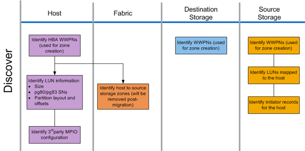

= Discover phase workflow
:icons: font
:imagesdir: ../media/

[.lead]
The discover phase of the migration process focuses on collecting information used for host remediation and creating migration plans in the later steps. The collection of most information is automated using a data collection tool, such as OneCollect.

The following figure shows the discover phase workflow.

The discover phase tasks are listed in the following table.
[cols="2*",options="header"]
|===
| Component| Tasks
a|
Host
a|

. Identify HBA WWPNs (used for zone creation).
. Identify LUN information (size, serial numbers, partition layouts, and offsets).
. Identify third-party MPIO configuration, host operating system, HBA/CNA models and firmware, and so on.

a|
Fabric
a|
Identify host to source storage zones. (These are removed post-migration).
a|
Destination storage
a|
Identify the WWPNs for the ports that will be used for initiator/target usage.
a|
Source storage
a|

. Identify WWPNs (used for zone creation).
. Identify LUNs mapped to the host.
. Identify initiator records for the host.

|===
