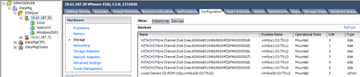

= Prepare hosts for FLI offline migration
:icons: font
:imagesdir: ../media/

[.lead]
Before you perform an FLI offline migration, you should reboot your hosts and verify your host LUN path and multipath configuration.
 
== Reboot the host to validate the system state

Before you begin the offline migration, you should perform any steps identified in the analysis phase necessary for host remediation such as installing host attach kits or DSMs.  After you have performed any necessary remediation steps, it is recommended that you reboot your hosts.

.Steps

. Shut down all your open applications.
. Reboot the host.
. Review the logs for errors.

== Verify host multipath configuration

Before you perform an FLI offline migration, you should verify that host multipathing is correctly configured and working properly. All available paths to LUNs should be active.

* For Windows host:  See link:https://docs.netapp.com/us-en/ontap-sanhost/hu_windows_2022.html#multipathing[Using Windows Server 2022 with ONTAP].
* For Linus hosts: Run the `multipath-ll` command
+
.Sample output of multipath-ll command
[%collapsible]
====
mpath2 (360060e801046b96004f2bf4600000012) dm-6 HITACHI,DF600F
[size=2.0G][features=0][hwhandler=0][rw]
\_ round-robin 0 [prio=1][active]
 \_ 0:0:1:2 sdg 8:96  [active][ready]
 \_ 1:0:1:2 sdo 8:224 [active][ready]
\_ round-robin 0 [prio=0][enabled]
 \_ 0:0:0:2 sdc 8:32  [active][ready]  \_ 1:0:0:2 sdk 8:160 [active][ready]
mpath1 (360060e801046b96004f2bf4600000011) dm-5 HITACHI,DF600F
[size=2.0G][features=0][hwhandler=0][rw]
\_ round-robin 0 [prio=1][active]
 \_ 0:0:0:1 sdb 8:16  [active][ready]
 \_ 1:0:0:1 sdj 8:144 [active][ready]
\_ round-robin 0 [prio=0][enabled]
 \_ 0:0:1:1 sdf 8:80  [active][ready]  \_ 1:0:1:1 sdn 8:208 [active][ready]
mpath0 (360060e801046b96004f2bf4600000010) dm-0 HITACHI,DF600F
[size=20G][features=0][hwhandler=0][rw]
\_ round-robin 0 [prio=1][active]
 \_ 0:0:1:0 sde 8:64  [active][ready]
 \_ 1:0:1:0 sdm 8:192 [active][ready]
\_ round-robin 0 [prio=0][enabled]
 \_ 0:0:0:0 sda 8:0   [active][ready]  \_ 1:0:0:0 sdi 8:128 [active][ready]
mpath3 (360060e801046b96004f2bf4600000013) dm-7 HITACHI,DF600F
[size=3.0G][features=0][hwhandler=0][rw]
\_ round-robin 0 [prio=1][active]
 \_ 0:0:0:3 sdd 8:48  [active][ready]
 \_ 1:0:0:3 sdl 8:176 [active][ready]
\_ round-robin 0 [prio=0][enabled]
 \_ 0:0:1:3 sdh 8:112 [active][ready]
 \_ 1:0:1:3 sdp 8:240 [active][ready]
[root@dm-rx200s6-22 ~]#
====

= Multipath verification for ESXi hosts
:icons: font
:imagesdir: ../media/

[.lead]
As part of the Foreign LUN Import (FLI) process, you should verify that multipath is configured and functioning correctly on your hosts.

Complete the following steps for ESXi hosts.

.Steps
. Determine ESXi and virtual machine using VMware vSphere Client.
+
image::../media/esxi_host_1.png[vSphere storage datastores]

. Determine SAN LUNs to be migrated using vSphere Client.
+

. Determine VMFS and RDM (vfat) volumes to be migrated: `esxcli storage filesystem list`
+
----
Mount Point                                        Volume Name        UUID                                 Mounted  Type           Size         Free
-------------------------------------------------  -----------------  -----------------------------------  -------  ------  -----------  -----------
/vmfs/volumes/538400f6-3486df59-52e5-00262d04d700  BootLun_datastore  538400f6-3486df59-52e5-00262d04d700     true  VMFS-5  13421772800  12486443008
/vmfs/volumes/53843dea-5449e4f7-88e0-00262d04d700  VM_datastore       53843dea-5449e4f7-88e0-00262d04d700     true  VMFS-5  42681237504   6208618496
/vmfs/volumes/538400f6-781de9f7-c321-00262d04d700                     538400f6-781de9f7-c321-00262d04d700     true  vfat     4293591040   4269670400
/vmfs/volumes/c49aad7f-afbab687-b54e-065116d72e55                     c49aad7f-afbab687-b54e-065116d72e55     true  vfat      261853184     77844480
/vmfs/volumes/270b9371-8fbedc2b-1f3b-47293e2ce0da                     270b9371-8fbedc2b-1f3b-47293e2ce0da     true  vfat      261853184    261844992
/vmfs/volumes/538400ef-647023fa-edef-00262d04d700                     538400ef-647023fa-edef-00262d04d700     true  vfat      299712512     99147776
~ #
----
+
[NOTE]
====
In case of VMFS with extends \(spanned VMFS\), all LUNs that are part of the span should be migrated. To show all the extends in the GUI, go to Configuration \> Hardware \> Storage and click datastore to select the Properties link.
====
+
[NOTE]
====
Post-migration, while adding them back to storage, you will see multiple LUN entries with the same VMFS label. In this scenario you should ask the customer to select only the entry marked as head.
====

. Determine the LUN and size to be migrated: `esxcfg-scsidevs -c`
+
----
Device UID                            Device Type      Console Device                                            Size      Multipath PluginDisplay Name
mpx.vmhba36:C0:T0:L0                  CD-ROM           /vmfs/devices/cdrom/mpx.vmhba36:C0:T0:L0                  0MB       NMP     Local Optiarc CD-ROM (mpx.vmhba36:C0:T0:L0)
naa.60060e801046b96004f2bf4600000014  Direct-Access    /vmfs/devices/disks/naa.60060e801046b96004f2bf4600000014  20480MB   NMP     HITACHI Fibre Channel Disk (naa.60060e801046b96004f2bf4600000014)
naa.60060e801046b96004f2bf4600000015  Direct-Access    /vmfs/devices/disks/naa.60060e801046b96004f2bf4600000015  40960MB   NMP     HITACHI Fibre Channel Disk (naa.60060e801046b96004f2bf4600000015)
~~~~~~ Output truncated ~~~~~~~
~ #
----

. Identify raw device mapping (RDM) LUNs to be migrated.
. Find RDM devices: `+find /vmfs/volumes -name **-rdm**+`
+
----
/vmfs/volumes/53843dea-5449e4f7-88e0-00262d04d700/Windows2003/Windows2003_1-rdmp.vmdk
/vmfs/volumes/53843dea-5449e4f7-88e0-00262d04d700/Windows2003/Windows2003_2-rdm.vmdk
/vmfs/volumes/53843dea-5449e4f7-88e0-00262d04d700/Linux/Linux_1-rdm.vmdk
/vmfs/volumes/53843dea-5449e4f7-88e0-00262d04d700/Solaris10/Solaris10_1-rdmp.vmdk
----

. Remove -rdmp and -rdm from preceding output and run the vmkfstools command to find vml mapping and RDM type.
+
----
# vmkfstools -q /vmfs/volumes/53843dea-5449e4f7-88e0-00262d04d700/Windows2003/Windows2003_1.vmdk
vmkfstools -q /vmfs/volumes/53843dea-5449e4f7-88e0-00262d04d700/Windows2003/Windows2003_1.vmdk
Disk /vmfs/volumes/53843dea-5449e4f7-88e0-00262d04d700/Windows2003/Windows2003_1.vmdk is a Passthrough Raw Device Mapping
Maps to: vml.020002000060060e801046b96004f2bf4600000016444636303046
~ # vmkfstools -q /vmfs/volumes/53843dea-5449e4f7-88e0-00262d04d700/Windows2003/Windows2003_2.vmdk
Disk /vmfs/volumes/53843dea-5449e4f7-88e0-00262d04d700/Windows2003/Windows2003_2.vmdk is a Non-passthrough Raw Device Mapping
Maps to: vml.020003000060060e801046b96004f2bf4600000017444636303046
~ # vmkfstools -q /vmfs/volumes/53843dea-5449e4f7-88e0-00262d04d700/Linux/Linux_1.vmdk
Disk /vmfs/volumes/53843dea-5449e4f7-88e0-00262d04d700/Linux/Linux_1.vmdk is a Non-passthrough Raw Device Mapping
Maps to: vml.020005000060060e801046b96004f2bf4600000019444636303046
~ # vmkfstools -q /vmfs/volumes/53843dea-5449e4f7-88e0-00262d04d700/Solaris10/Solaris10_1.vmdk
Disk /vmfs/volumes/53843dea-5449e4f7-88e0-00262d04d700/Solaris10/Solaris10_1.vmdk is a Passthrough Raw Device Mapping
Maps to: vml.020004000060060e801046b96004f2bf4600000018444636303046
~ #
----
+
[NOTE]
====
Passthrough is RDM with physical \(RDMP\), and nonpassthrough is RDM with virtual \(RDMV\). VMs with virtual RDMs and VM Snapshot copies will break after migration due to VM Snapshot delta vmdk pointing to an RDM that has a stale naa ID. So before migration, ask the customer to remove all Snapshot copies in such VMs. Right-click VM and click the Snapshot --\> Snapshot Manager Delete All button. Refer to NetApp KB 3013935 for details about hardware-accelerated locking for VMware on NetApp storage.
====

. Identify LUN naa to RDM device mapping.
+
----
~ # esxcfg-scsidevs -u | grep vml.020002000060060e801046b96004f2bf4600000016444636303046
naa.60060e801046b96004f2bf4600000016                            vml.020002000060060e801046b96004f2bf4600000016444636303046
~ # esxcfg-scsidevs -u | grep vml.020003000060060e801046b96004f2bf4600000017444636303046
naa.60060e801046b96004f2bf4600000017                            vml.020003000060060e801046b96004f2bf4600000017444636303046
~ # esxcfg-scsidevs -u | grep vml.020005000060060e801046b96004f2bf4600000019444636303046
naa.60060e801046b96004f2bf4600000019                            vml.020005000060060e801046b96004f2bf4600000019444636303046
~ # esxcfg-scsidevs -u | grep vml.020004000060060e801046b96004f2bf4600000018444636303046
naa.60060e801046b96004f2bf4600000018                            vml.020004000060060e801046b96004f2bf4600000018444636303046
~ #
----

. Determine virtual machine configuration: `esxcli storage filesystem list | grep VMFS`
+
----
/vmfs/volumes/538400f6-3486df59-52e5-00262d04d700  BootLun_datastore  538400f6-3486df59-52e5-00262d04d700     true  VMFS-5  13421772800  12486443008
/vmfs/volumes/53843dea-5449e4f7-88e0-00262d04d700  VM_datastore       53843dea-5449e4f7-88e0-00262d04d700     true  VMFS-5  42681237504   6208618496
~ #
----

. Record the UUID of the datastore.
. Make a copy of `/etc/vmware/hostd/vmInventory.xml` and note the contents of file and vmx config path.
+
----
~ # cp /etc/vmware/hostd/vmInventory.xml /etc/vmware/hostd/vmInventory.xml.bef_mig
~ # cat /etc/vmware/hostd/vmInventory.xml
<ConfigRoot>
  <ConfigEntry id="0001">
    <objID>2</objID>
    <vmxCfgPath>/vmfs/volumes/53843dea-5449e4f7-88e0-00262d04d700/Windows2003/Windows2003.vmx</vmxCfgPath>
  </ConfigEntry>
  <ConfigEntry id="0004">
    <objID>5</objID>
    <vmxCfgPath>/vmfs/volumes/53843dea-5449e4f7-88e0-00262d04d700/Linux/Linux.vmx</vmxCfgPath>
  </ConfigEntry>
  <ConfigEntry id="0005">
    <objID>6</objID>
    <vmxCfgPath>/vmfs/volumes/53843dea-5449e4f7-88e0-00262d04d700/Solaris10/Solaris10.vmx</vmxCfgPath>
  </ConfigEntry>
</ConfigRoot>
----

. Identify the virtual machine hard disks.
+
This information is required post-migration to add the removed RDM devices in order.
+
----
~ # grep fileName /vmfs/volumes/53843dea-5449e4f7-88e0-00262d04d700/Windows2003/Windows2003.vmx
scsi0:0.fileName = "Windows2003.vmdk"
scsi0:1.fileName = "Windows2003_1.vmdk"
scsi0:2.fileName = "Windows2003_2.vmdk"
~ # grep fileName /vmfs/volumes/53843dea-5449e4f7-88e0-00262d04d700/Linux/Linux.vmx
scsi0:0.fileName = "Linux.vmdk"
scsi0:1.fileName = "Linux_1.vmdk"
~ # grep fileName /vmfs/volumes/53843dea-5449e4f7-88e0-00262d04d700/Solaris10/Solaris10.vmx
scsi0:0.fileName = "Solaris10.vmdk"
scsi0:1.fileName = "Solaris10_1.vmdk"
~ #
----

. Determine RDM device, virtual machine mapping, and compatibility mode.
. Using the preceding information, note the RDM mapping to device, virtual machine, compatibility mode, and order.
+
You will need this information later, when adding RDM devices to the VM.
+
----
Virtual Machine -> Hardware -> NAA -> Compatibility mode
Windows2003 VM -> scsi0:1.fileName = "Windows2003_1.vmdk" -> naa.60060e801046b96004f2bf4600000016
-> RDM Physical
Windows2003 VM -> scsi0:2.fileName = "Windows2003_2.vmdk" -> naa.60060e801046b96004f2bf4600000017
-> RDM Virtual
Linux VM -> scsi0:1.fileName = “Linux_1.vmdk” -> naa.60060e801046b96004f2bf4600000019 -> RDM Virtual
Solaris10 VM -> scsi0:1.fileName = “Solaris10_1.vmdk” -> naa.60060e801046b96004f2bf4600000018 -> RDM Physical
----

. Determine multipath configuration.
. Obtain multipath settings for your storage in the vSphere Client:
 .. Select an ESX or ESXi host in the vSphere Client and click the Configuration tab.
 .. Click *Storage*.
 .. Select a datastore or mapped LUN.
 .. Click *Properties*.
 .. In the Properties dialog box, select the desired extent, if necessary.
 .. Click *Extent Device* > *Manage Paths* and obtain the paths in the Manage Path dialog box.
+
image::../media/esxi_host_3.png[vSphere storage devices paths]
. Obtain LUN multipathing information from the ESXi host command line:
 .. Log in to the ESXi host console.
 .. Run esxcli storage nmp device list to get multipath information.
+
----
# esxcli storage nmp device list
naa.60060e801046b96004f2bf4600000014
   Device Display Name: HITACHI Fibre Channel Disk (naa.60060e801046b96004f2bf4600000014)
   Storage Array Type: VMW_SATP_DEFAULT_AA
   Storage Array Type Device Config: SATP VMW_SATP_DEFAULT_AA does not support device configuration.
   Path Selection Policy: VMW_PSP_RR
   Path Selection Policy Device Config: {policy=rr,iops=1000,bytes=10485760,useANO=0; lastPathIndex=3: NumIOsPending=0,numBytesPending=0}
   Path Selection Policy Device Custom Config:
   Working Paths: vmhba2:C0:T1:L0, vmhba2:C0:T0:L0, vmhba1:C0:T1:L0, vmhba1:C0:T0:L0
   Is Local SAS Device: false
   Is Boot USB Device: false

naa.60060e801046b96004f2bf4600000015
   Device Display Name: HITACHI Fibre Channel Disk (naa.60060e801046b96004f2bf4600000015)
   Storage Array Type: VMW_SATP_DEFAULT_AA
   Storage Array Type Device Config: SATP VMW_SATP_DEFAULT_AA does not support device configuration.
   Path Selection Policy: VMW_PSP_RR
   Path Selection Policy Device Config: {policy=rr,iops=1000,bytes=10485760,useANO=0; lastPathIndex=0: NumIOsPending=0,numBytesPending=0}
   Path Selection Policy Device Custom Config:
   Working Paths: vmhba2:C0:T1:L1, vmhba2:C0:T0:L1, vmhba1:C0:T1:L1, vmhba1:C0:T0:L1
   Is Local SAS Device: false
   Is Boot USB Device: false

naa.60060e801046b96004f2bf4600000016
   Device Display Name: HITACHI Fibre Channel Disk (naa.60060e801046b96004f2bf4600000016)
   Storage Array Type: VMW_SATP_DEFAULT_AA
   Storage Array Type Device Config: SATP VMW_SATP_DEFAULT_AA does not support device configuration.
   Path Selection Policy: VMW_PSP_RR
   Path Selection Policy Device Config: {policy=rr,iops=1000,bytes=10485760,useANO=0; lastPathIndex=1: NumIOsPending=0,numBytesPending=0}
   Path Selection Policy Device Custom Config:
   Working Paths: vmhba2:C0:T1:L2, vmhba2:C0:T0:L2, vmhba1:C0:T1:L2, vmhba1:C0:T0:L2
   Is Local SAS Device: false
   Is Boot USB Device: false

naa.60060e801046b96004f2bf4600000017
   Device Display Name: HITACHI Fibre Channel Disk (naa.60060e801046b96004f2bf4600000017)
   Storage Array Type: VMW_SATP_DEFAULT_AA
   Storage Array Type Device Config: SATP VMW_SATP_DEFAULT_AA does not support device configuration.
   Path Selection Policy: VMW_PSP_RR
   Path Selection Policy Device Config: {policy=rr,iops=1000,bytes=10485760,useANO=0; lastPathIndex=1: NumIOsPending=0,numBytesPending=0}
   Path Selection Policy Device Custom Config:
   Working Paths: vmhba2:C0:T1:L3, vmhba2:C0:T0:L3, vmhba1:C0:T1:L3, vmhba1:C0:T0:L3
   Is Local SAS Device: false
   Is Boot USB Device: false

naa.60060e801046b96004f2bf4600000018
   Device Display Name: HITACHI Fibre Channel Disk (naa.60060e801046b96004f2bf4600000018)
   Storage Array Type: VMW_SATP_DEFAULT_AA
   Storage Array Type Device Config: SATP VMW_SATP_DEFAULT_AA does not support device configuration.
   Path Selection Policy: VMW_PSP_RR
   Path Selection Policy Device Config: {policy=rr,iops=1000,bytes=10485760,useANO=0; lastPathIndex=1: NumIOsPending=0,numBytesPending=0}
   Path Selection Policy Device Custom Config:
   Working Paths: vmhba2:C0:T1:L4, vmhba2:C0:T0:L4, vmhba1:C0:T1:L4, vmhba1:C0:T0:L4
   Is Local SAS Device: false
   Is Boot USB Device: false

naa.60060e801046b96004f2bf4600000019
   Device Display Name: HITACHI Fibre Channel Disk (naa.60060e801046b96004f2bf4600000019)
   Storage Array Type: VMW_SATP_DEFAULT_AA
   Storage Array Type Device Config: SATP VMW_SATP_DEFAULT_AA does not support device configuration.
   Path Selection Policy: VMW_PSP_RR
   Path Selection Policy Device Config: {policy=rr,iops=1000,bytes=10485760,useANO=0; lastPathIndex=1: NumIOsPending=0,numBytesPending=0}
   Path Selection Policy Device Custom Config:
   Working Paths: vmhba2:C0:T1:L5, vmhba2:C0:T0:L5, vmhba1:C0:T1:L5, vmhba1:C0:T0:L5
   Is Local SAS Device: false
   Is Boot USB Device: false
----

// 23 June 2025, ONTAPDOC-3057