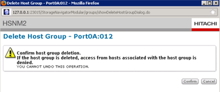

= Removing destination array configuration
:icons: font
:imagesdir: ../media/

[.lead]
The following steps show how to remove the destination array configuration from the source array after FLI migration is complete.

.Steps
. Log in to Hitachi Storage Navigator Modular as system.
. Select *AMS 2100* array and click *Show* and *Configure Array*.
. Log in using root.
. Expand Groups and select *Host Groups*.
. Select *cDOT_FLI* host group and click *Delete Host Group*.
+
image::../media/remove_destination_array_configuration_from_source_array_1.png[]

. Confirm the host group deletion.
+

