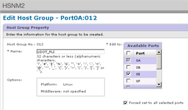

= Removing source LUNs from ONTAP storage
:icons: font
:imagesdir: ../media/

[.lead]
The following steps describe how to remove source LUNs from your ONTAP storage after migration is complete.

. Log in to Hitachi Storage Navigator Modular.
. Select the ONTAP host group created during the plan phase and select *Edit Host Group*.
+
image::../media/remove_source_luns_from_ontap_storage_1.png[Host groups]

. Select the *Ports* and select *Forced set* to all selected ports.
+

. Select the host LUNs that are migrated from Assigned Logical LUNs. Use LUN Names for each host mentioned in the Source LUNs worksheet. Here, select LUNs of Windows 2012, RHEL 5.10, and ESXi 5.5 hosts and select *Remove*.
+
image::../media/remove_source_luns_from_ontap_storage_3.png[]

*Related information*

xref:reference_sample_site_survey_and_planning_worksheet.adoc[Sample Site Survey and Planning worksheet]
